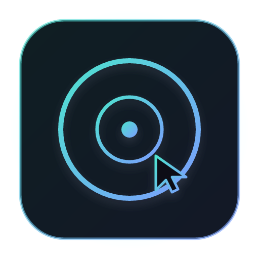
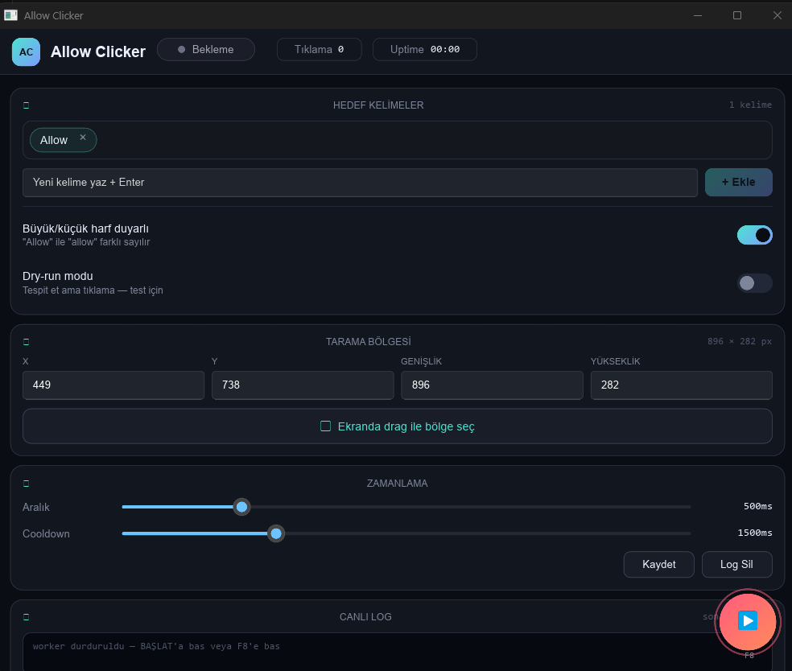

<div align="center">
  

# Allow Clicker

**Ekranda belirlediğin kelime(ler) göründüğünde otomatik olarak tıklayan modern Rust/Slint masaüstü aracı.**

   

</div>

---

## 🎯 Ne işe yarar?

Sürekli karşına çıkan onay dialoglarını, "Allow / İzin Ver / Yes" tuşlarını, veya herhangi bir metni tespit edip otomatik tıklar. Örnekler:
- Dev tool izin istekleri (Claude Code, Cursor, VS Code vb.)
- Yazılım kurulum sihirbazları
- Oyun içi tekrarlayan onay ekranları
- İş akışında sürekli tekrarlanan dialog kutuları

Birden fazla hedef kelime tanımlanabilir; **çok kelimeli ifadeler** de desteklenir (örn. `Astra Bey`, `İzin Ver`, `Yes Continue`).

## ✨ Özellikler

- 🎯 **Windows.Media.Ocr** — işletim sistemine bağlı native OCR, ekstra bağımlılık yok
- 🖼 **Drag ile bölge seçici** — ekranda saydam overlay, fare ile dikdörtgen çiz (ESC = iptal)
- 📝 **Çoklu hedef kelime** — chip tabanlı liste, Enter ile ekle, × ile sil
- 🧠 **Sliding-window match** — "Astra Bey" gibi birden fazla kelime içeren hedefler
- 🔤 **Büyük/küçük harf duyarlılığı** toggle
- 🧪 **Dry-run** modu — test için tespit et ama tıklama
- ⏱ **Interval + Cooldown** slider ayarları (100-2000ms / 200-5000ms)
- ⌨ **F8 global kısayol** — pencere arkada iken bile başlat/durdur
- 💾 **JSON config kalıcı** — `%APPDATA%\Local\AllowClicker\config.json`
- 📜 **Canlı log** — son 100 satır, timestamp'li tespit/tıklama olayları
- 🎨 **Modern dark-neon UI** — Slint + fluent-dark, gradient brand, drop-shadow glow, pulsing status dot, FAB (floating action button)
- 🖥 **Multi-monitor** — hedef bölge hangi ekrandaysa oradan capture
- 🎯 Noktalama toleranslı match (`Allow.` = `Allow`)

## 📸 Ekran görüntüsü

<div align="center">
  
</div>

## 🚀 Kurulum

### Önkoşullar
- Windows 10/11
- [Rust](https://rustup.rs/) 1.75+ (`rustup install stable`)
- Windows OCR dil paketi: `Ayarlar → Zaman ve Dil → Dil → İngilizce (veya Türkçe) → Seçenekler → OCR` kurulu olmalı

### Derleme
```bash
git clone https://github.com/r00tastic/allow_clicker.git
cd allow_clicker
cargo build --release
```

Derleme ~1-2 dakika sürer (ilk kez `windows` + `slint` crate'leri indirir).

### Çalıştırma
```bash
.\target\release\allow_clicker.exe
```

## 📖 Kullanım

1. **Kelime ekle** — "Yeni kelime yaz + Enter" alanına yaz, Enter'a bas (veya + Ekle butonuna tıkla). Birden fazla kelime (`Yes No`, `İzin Ver`) de olabilir.
2. **Bölge seç** — "Ekranda drag ile bölge seç" butonuna bas, ekran karartıldığında fare ile hedef bölgeyi dikdörtgen olarak çiz. Boş bırakırsan tüm ekran taranır.
3. **Zamanlama ayarla** — Aralık (tarama sıklığı) ve Cooldown (tıklamadan sonra bekleme) slider'ları.
4. **BAŞLAT** — FAB butonuna veya `F8`'e bas. Program arka planda tespit yapar ve tıklar.
5. **DURDUR** — tekrar FAB veya `F8`.

### Dry-run modu
Test için — gerçekten tıklamadan sadece tespit eder, log'da `[DRY-RUN]` görülür. Yeni bir kelime/bölge ayarı denerken kullan.

## 🛠 Teknik mimari

```
src/
├── main.rs          # Slint entegrasyonu + callback'ler + UI tick timer
├── config.rs        # JSON config load/save (serde + directories)
├── ocr.rs           # Windows.Media.Ocr wrapper + sliding-window match
├── clicker.rs       # OCR + click worker thread (atomic signal stop)
├── region_picker.rs # Win32 saydam overlay drag selector
└── hotkey.rs        # F8 global hotkey (global-hotkey crate)

ui/
└── main.slint       # Modern Slint UI — Card, Chip, FAB, NeonToggle, Path ikonlar

build.rs             # Slint compile + Windows subsystem + icon embed
```

### Thread modeli
- **UI thread** — Slint event loop, callback'ler, 80ms tick timer (hotkey + log drain)
- **Worker thread** — OCR + click loop, `AtomicBool` ile interrupt
- **Region picker thread** — Win32 message loop, mpsc ile sonuç UI'ya

## 🧩 Bağımlılıklar

| Crate | Amaç |
|---|---|
| `slint` 1.18 | Modern declarative GUI |
| `windows` 0.60 | Windows.Media.Ocr + Win32 (region picker) |
| `xcap` 0.0.14 | Monitor capture |
| `enigo` 0.2 | Mouse control (click + move) |
| `global-hotkey` 0.6 | F8 global kısayol |
| `image` 0.25 | Capture → OCR dönüşümü |
| `serde` + `serde_json` | Config persistence |
| `chrono` | Log timestamp |

## 🤝 Katkı

PR'lar hoş karşılanır. Önce bir issue aç.

## 📄 Lisans

[MIT](LICENSE)

## 🙏 Notlar

Bu araç **kendi iş akışını hızlandırmak** için tasarlanmıştır. Lütfen başkalarının onayını atlatmak, güvenlik dialoglarını otomatik kabul etmek veya kötüye kullanmak için kullanma.
